# Flowchart Sistem — SIDIGAS

**Simbol:**

| Simbol Mermaid | Nama | Keterangan |
|----------------|------|------------|
| `(["..."])` | Terminal | Permulaan/akhir suatu proses |
| `[/"..."/]` | Input/Output | Proses input/output data |
| `["..."]` | Proses | Pelaksanaan pemrosesan komputer |
| `[["..."]]` | Predefined Process | Penyimpanan penyediaan/pemberian harga awal |
| `{"..."}` | Decision | Kondisi yang menghasilkan beberapa kemungkinan |
| `-->` | Arus Pemrosesan | Arah aliran proses |
| `-.->` | Off-Page Connector | Keluar/masuk proses di halaman lain |

---

## 1. Login (Email & Password)

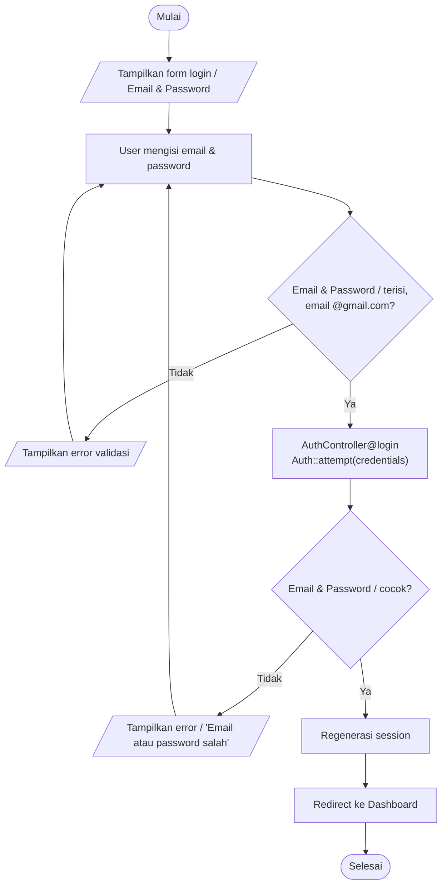

---

## 2. Login Google

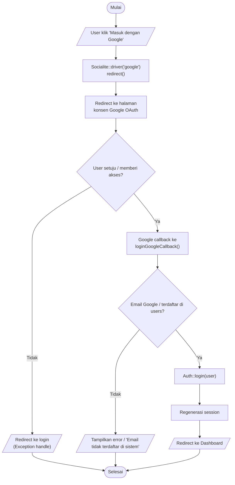

---

## 3. Lupa Password — Request OTP

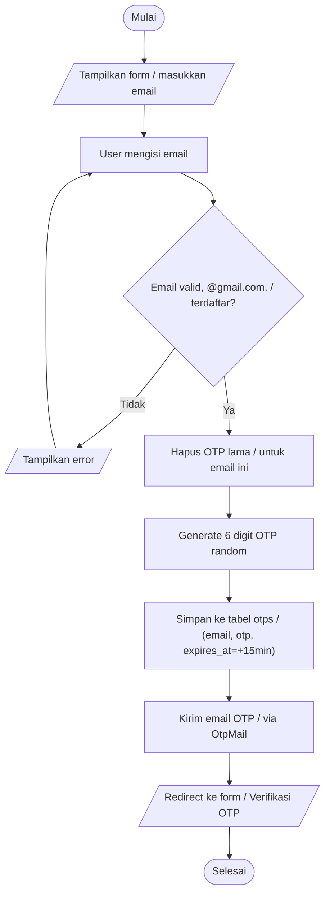

---

## 4. Verifikasi OTP

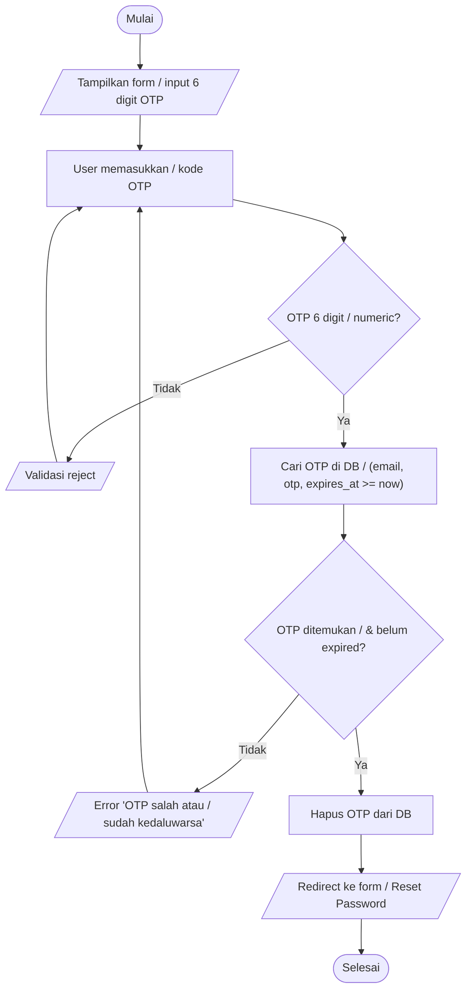

---

## 5. Reset Password

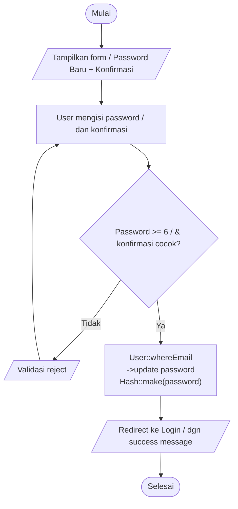

---

## 6. Dashboard

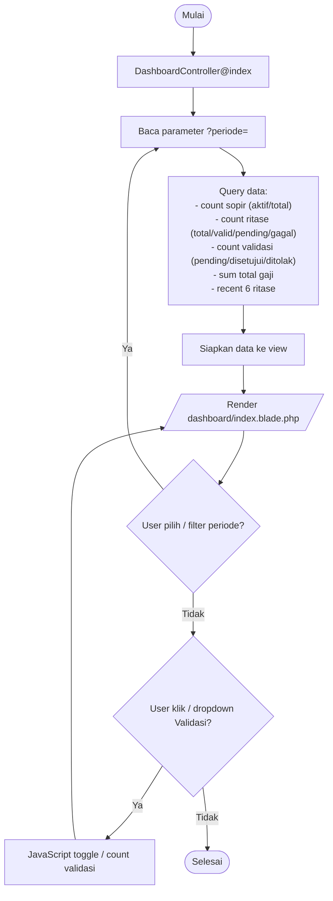

---

## 7. Profil — Lihat & Edit

```mermaid
flowchart TD
    START(["Mulai"])
    START --> LIHAT[/"Tampilkan halaman Profil / (nama, email, avatar, join date)"/]
    LIHAT --> FORM[/"Form edit: nama, email,<br/>password_lama, password_baru,<br/>password_baru_confirmation"/]
    FORM --> ISI["User edit data & submit"]
    ISI --> C_VALID{Nama >=3, <=100<br/>Email unique (kecuali milik sendiri)<br/>Fields valid?}
    C_VALID -- Tidak --> E_FORM[/"Tampilkan error validasi"/]
    E_FORM --> FORM
    C_VALID -- Ya --> C_GANTI_PASS{password_baru / diisi?}
    C_GANTI_PASS -- Tidak --> UPDATE_INFO["Update name & email"]
    C_GANTI_PASS -- Ya --> C_LAMA_BENAR{password_lama / cocok dgn current?}
    C_LAMA_BENAR -- Tidak --> E_PASS[/"Error 'Password lama tidak sesuai'"/]
    E_PASS --> FORM
    C_LAMA_BENAR -- Ya --> C_BARU_VALID{password_baru >=6 / & confirmed?}
    C_BARU_VALID -- Tidak --> E_FORM
    C_BARU_VALID -- Ya --> UPDATE_ALL["Update name, email,<br/>& password (Hash::make)"]
    UPDATE_INFO --> SUCCESS[/"Success message"/]
    UPDATE_ALL --> SUCCESS
    SUCCESS --> LIHAT
```

---

## 8. Sopir — CRUD

```mermaid
flowchart TD
    START(["Mulai"])
    START --> INDEX[/"Tampilkan daftar sopir / (10/page, search, stats)"/]

    INDEX --> C_ACTION{Pilih aksi?}

    C_ACTION -- Cari --> SEARCH["Input search keyword"]
    SEARCH --> QUERY["Query sopir where<br/>nama/kode_sopir like %keyword%"]
    QUERY --> INDEX

    C_ACTION -- Tambah --> ADD_FORM[/"Modal form input nama"/]
    ADD_FORM --> ADD_ISI["User input nama"]
    ADD_ISI --> C_ADD_VALID{Nama >=3, <=255?}
    C_ADD_VALID -- Tidak --> E_ADD[/"Validasi reject"/]
    E_ADD --> ADD_FORM
    C_ADD_VALID -- Ya --> STORE["Simpan: generate kode SPR-XXX,<br/>status='aktif'"]
    STORE --> ADD_CLOSE[/"Tutup modal, success"/]
    ADD_CLOSE --> INDEX

    C_ACTION -- Edit --> EDIT_FORM[/"Modal form edit nama & status"/]
    EDIT_FORM --> EDIT_ISI["User ubah nama/status"]
    EDIT_ISI --> C_EDIT_VALID{Nama valid,<br/>status in [aktif/nonaktif]?}
    C_EDIT_VALID -- Tidak --> E_EDIT[/"Validasi reject"/]
    E_EDIT --> EDIT_FORM
    C_EDIT_VALID -- Ya --> UPDATE["Update sopir"]
    UPDATE --> EDIT_CLOSE[/"Tutup modal, success"/]
    EDIT_CLOSE --> INDEX

    C_ACTION -- Hapus --> C_PUNYA_RITASE{Sopir punya / data ritase?}
    C_PUNYA_RITASE -- Ya --> E_HAPUS[/"Error 'Tidak bisa hapus, / ada data ritase'"/]
    E_HAPUS --> INDEX
    C_PUNYA_RITASE -- Tidak --> KONFIRM[/"Modal konfirmasi hapus"/]
    KONFIRM --> C_YAKIN{Yakin hapus?}
    C_YAKIN -- Tidak --> INDEX
    C_YAKIN -- Ya --> DESTROY["Delete sopir"]
    DESTROY --> HAPUS_CLOSE[/"Tutup modal, success"/]
    HAPUS_CLOSE --> INDEX
```

---

## 9. Tujuan — CRUD

*(Pola sama seperti Sopir, ganti Sopir → Tujuan, kode TUJ-XXX)*

```mermaid
flowchart TD
    START(["Mulai"])
    START --> INDEX[/"Tampilkan daftar tujuan / (10/page, search, stats)"/]

    INDEX --> C_ACTION{Pilih aksi?}

    C_ACTION -- Cari --> SEARCH["Input search keyword"]
    SEARCH --> QUERY["Query tujuan where<br/>nama/kode_tujuan like %keyword%"]
    QUERY --> INDEX

    C_ACTION -- Tambah --> ADD_FORM[/"Modal form input nama"/]
    ADD_FORM --> ADD_ISI["User input nama"]
    ADD_ISI --> C_ADD_VALID{Nama >=3, <=255?}
    C_ADD_VALID -- Tidak --> E_ADD[/"Validasi reject"/]
    E_ADD --> ADD_FORM
    C_ADD_VALID -- Ya --> STORE["Simpan: generate kode TUJ-XXX,<br/>status='aktif'"]
    STORE --> ADD_CLOSE[/"Tutup modal, success"/]
    ADD_CLOSE --> INDEX

    C_ACTION -- Edit --> EDIT_FORM[/"Modal form edit nama & status"/]
    EDIT_FORM --> EDIT_ISI["User ubah nama/status"]
    EDIT_ISI --> C_EDIT_VALID{Nama valid,<br/>status in [aktif/nonaktif]?}
    C_EDIT_VALID -- Tidak --> E_EDIT[/"Validasi reject"/]
    E_EDIT --> EDIT_FORM
    C_EDIT_VALID -- Ya --> UPDATE["Update tujuan"]
    UPDATE --> EDIT_CLOSE[/"Tutup modal, success"/]
    EDIT_CLOSE --> INDEX

    C_ACTION -- Hapus --> C_PUNYA_RITASE{Tujuan punya / data ritase?}
    C_PUNYA_RITASE -- Ya --> E_HAPUS[/"Error 'Tidak bisa hapus, / ada data ritase'"/]
    E_HAPUS --> INDEX
    C_PUNYA_RITASE -- Tidak --> KONFIRM[/"Modal konfirmasi hapus"/]
    KONFIRM --> C_YAKIN{Yakin hapus?}
    C_YAKIN -- Tidak --> INDEX
    C_YAKIN -- Ya --> DESTROY["Delete tujuan"]
    DESTROY --> HAPUS_CLOSE[/"Tutup modal, success"/]
    HAPUS_CLOSE --> INDEX
```

---

## 10. Periode — CRUD

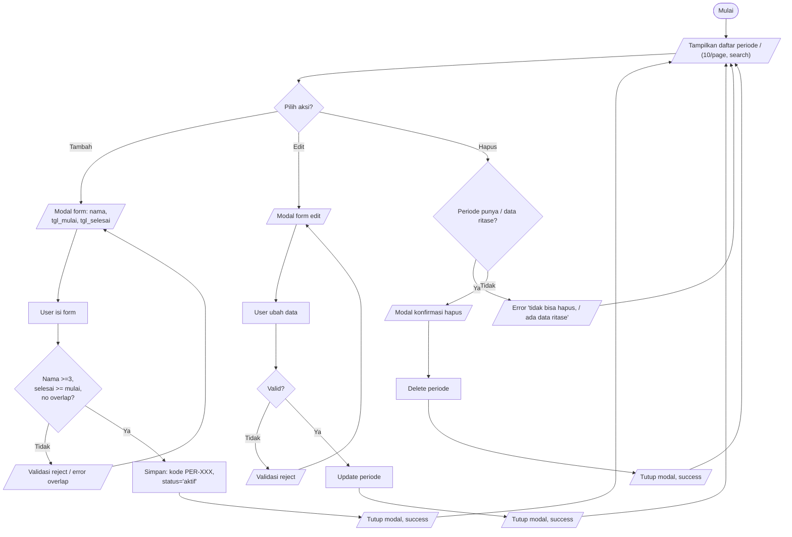

---

## 11. Ritase — CRUD + DT Logic

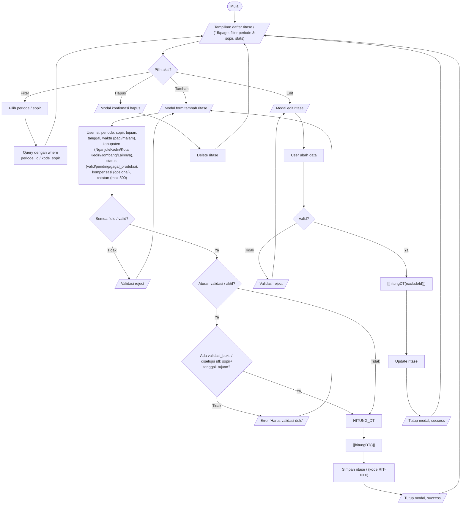

### Subproses hitungDT()

```mermaid
flowchart TD
    START(["hitungDT()"])
    START --> INPUT[/"Input: status, kabupaten,<br/>sopir, tanggal, waktu,<br/>excludeId (optional)"/]
    INPUT --> C_GAGAL{Status = / gagal_produksi?}
    C_GAGAL -- Ya --> DT0["return DT = 0"]
    DT0 --> KEMBALI(["Kembali"])
    C_GAGAL -- Tidak --> C_DUPLIKAT{Ada ritase lain<br/>sama sopir + tgl +<br/>kabupaten + waktu<br/>(exclude excludeId)?}
    C_DUPLIKAT -- Ya --> DT0
    C_DUPLIKAT -- Tidak --> DT330["return DT = 330000"]
    DT330 --> KEMBALI(["Kembali"])
```

---

## 12. Validasi Bukti — Submit (User/Sopir)

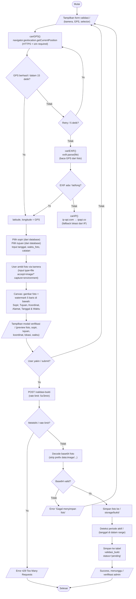

---

## 13. Validasi Bukti — Admin (Kelola, Approve, Reject, Tambah Ritase)

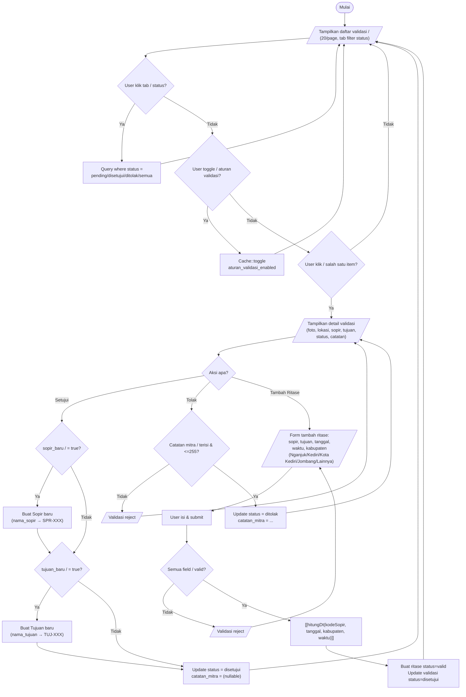

---

## 14. Penggajian — Hitung & Simpan

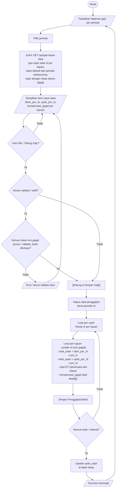

---

## 15. Laporan & Riwayat

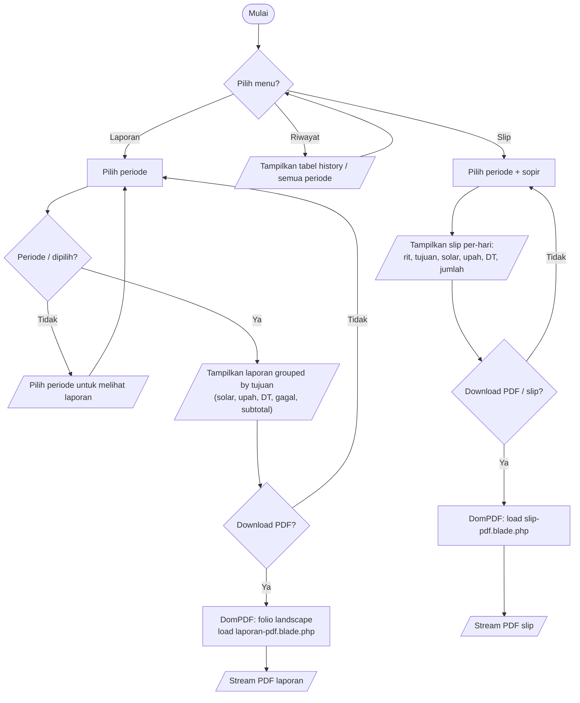

---

## 16. Logout

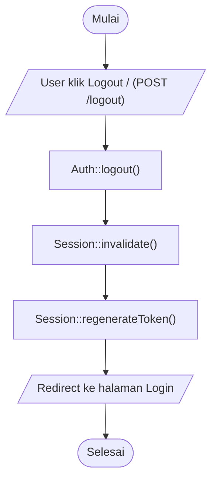

---

## 17. Navigasi Utama Guest → Login → Semua Fitur

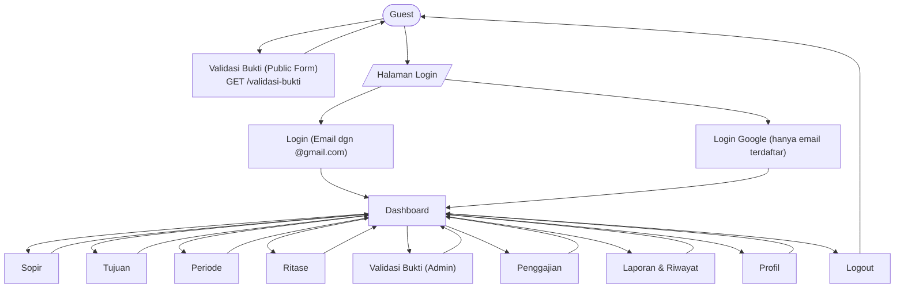
